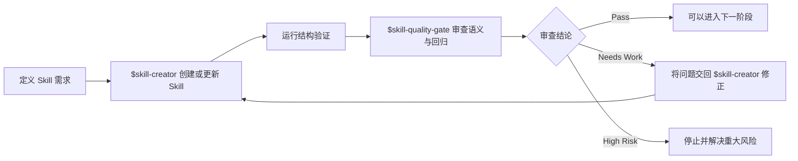

<div align="center">

# Skill Quality Gate

**面向可复用 Codex Skill、以证据为基础的语义与回归审查。**

[English](README.md) · 简体中文


[](LICENSE)


在 Skill 被视为就绪之前，发现路由错误、工作流漂移、证据不足和不安全的权限边界。

</div>

---

## 为什么需要它

一个 Skill 即使通过了结构验证，也仍然可能表现不佳：触发范围可能过宽，工作流可能与其他权威来源重复，评估文件也可能只是描述了从未真正执行过的测试。

`skill-quality-gate` 用于在 Skill 创建完成或经历重大更新后，审查这类语义与回归风险。它是结构验证的补充，而不是替代品。

### 设计来源

本 Skill 综合了 Anthropic 与 OpenAI 公开发布的指导和设计模式，以及作者在真实工作流中创建、测试和维护 Codex Skill 所获得的一手经验。它将反复出现的失效模式、实践陷阱和审查经验提炼为一套可复用的质量门控工作流。

| 审查领域 | 质量门控关注什么 |
|---|---|
| 触发与路由 | 过度触发、触发不足以及职责归属冲突 |
| 工作流设计 | 不必要的范围、薄弱的停止条件以及不良的渐进式披露 |
| 验证证据 | 缺少依据的通过结论，以及尚未执行的评估规范 |
| 安全与权限 | 凭证、外部操作、文件系统变更以及不可逆后果 |
| 回归覆盖 | 缺失的正例、反例、边界案例和输出质量案例 |

## 与 skill-creator 配合使用

`skill-quality-gate` 是 OpenAI 官方 `skill-creator` 的补充，而不是替代品。二者分别服务于 Skill 开发生命周期中的不同阶段：

| Skill | 主要职责 |
|---|---|
| `$skill-creator` | 创建、构建或进行重大更新，并管理相应的支持资源 |
| `$skill-quality-gate` | 独立审查已完成的结果，发现语义缺陷、路由错误、证据缺口、安全风险和可能的回归 |

典型工作流如下：



使用 `$skill-creator` 完成实现和针对性修正；这些工作完成后，再使用 `$skill-quality-gate` 判断结果是否具备足够的证据和质量，可以继续推进。

> [!IMPORTANT]
> 该质量门控不能作为自身变更的唯一审查者。对它自身的修改，应依据当前外部指导和有代表性的案例进行独立审查。

## 何时使用

在以下情况下使用本 Skill：

- 一个可复用 Skill 刚刚创建完成；
- 一个 Skill 经历了重大的语义更新；或
- 你明确希望审查一个现有 Skill。

不要将它用于构思、常规实现、安装、非语义性修改，或仅仅执行结构验证。

## 安装

将本仓库克隆到你的个人 Agent Skills 目录中。

### macOS 或 Linux

```bash
git clone https://github.com/kayla9928/skill-quality-gate.git \
  "$HOME/.agents/skills/skill-quality-gate"
```

### Windows PowerShell

```powershell
git clone https://github.com/kayla9928/skill-quality-gate.git `
  "$HOME\.agents\skills\skill-quality-gate"
```

Codex 通常会自动检测 Skill 的变化。如果没有显示该 Skill，请重启 Codex。

## 使用方法

在实现和结构验证完成后，显式调用它：

```text
$skill-quality-gate review this completed Skill for behavioral regressions,
routing errors, validation gaps, and material safety risks.
```

当请求符合 `SKILL.md` 中的激活描述时，Codex 也可能自动选择该 Skill。

## 审查深度

质量门控会根据变更的风险和范围调整审查投入。

| 深度 | 适用情况 | 主要关注点 |
|---|---|---|
| `focused` | Frontmatter 或一项狭窄行为 | 已变更的契约及相关验证 |
| `standard` | 工作流、参考资料、模板或重复行为 | 语义、渐进式披露、激活和输出覆盖 |
| `extended` | 持久状态、广泛权限或不可逆操作 | 标准审查，加上适用的安全性和时效性检查 |

## 输出

每次审查都会首先给出以下结论之一：

| 结论 | 含义 |
|---|---|
| `Pass` | 不存在阻断性问题，并且相关验证能够支持本次审查范围 |
| `Needs Work` | 存在有实际影响但范围可控的缺陷，需要进行针对性修正 |
| `High Risk` | 仍存在重大的安全、权限、完整性或不可逆后果风险 |

根据现有证据，报告还可能包含必须修复的问题、验证结果与缺口、触发覆盖情况以及重大的残余风险。

<details>
<summary><strong>仓库内容</strong></summary>

```text
skill-quality-gate/
├── SKILL.md
├── agents/
│   └── openai.yaml
├── evaluation/
│   ├── quality-cases.md
│   └── trigger-cases.md
└── references/
    ├── evaluation-templates.md
    ├── gotchas.md
    └── quality-checklist.md
```

- `SKILL.md` 定义激活边界、审查流程和报告契约。
- `references/` 包含语义检查清单、可复用的失效机制和轻量级评估模板。
- `evaluation/` 包含激活与审查质量规范。

</details>

## 证据边界

评估文件描述的是预期行为；文件存在本身并不能证明其中的案例已经执行。质量门控会分别报告已执行的检查与文档化的预期，并将不可用的验证器视为证据缺口，而不是自动判定通过或失败。

## 许可证

本项目采用 [MIT License](LICENSE) 许可。
