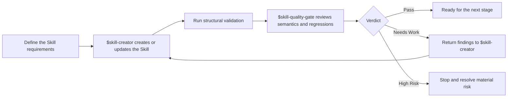

<div align="center">

# Skill Quality Gate

**Evidence-based semantic and regression review for reusable Codex Skills.**

English · [简体中文](README-ZH.md)


[](LICENSE)


Catch routing mistakes, workflow drift, weak evidence, and unsafe authority
boundaries before a Skill is considered ready.

</div>

---

## Why this exists

A Skill can be structurally valid and still behave badly. Its trigger may be
too broad, its workflow may duplicate another authority, or its evaluation
files may describe tests that were never executed.

`skill-quality-gate` reviews those semantic and regression risks after a Skill
has been created or substantially updated. It complements structural
validation; it does not replace it.

### Design provenance

This Skill synthesizes publicly documented guidance and design patterns from
Anthropic and OpenAI with first-hand lessons from creating, testing, and
maintaining Codex Skills in real workflows. It distills recurring failure
modes, practical pitfalls, and review experience into a reusable quality-gate
workflow.

| Review area | What the gate looks for |
|---|---|
| Trigger and routing | Over-triggering, under-triggering, and ownership collisions |
| Workflow design | Unnecessary scope, weak stopping conditions, and poor progressive disclosure |
| Validation evidence | Unsupported pass claims and unexecuted evaluation specifications |
| Safety and authority | Credentials, external actions, filesystem mutation, and irreversible consequences |
| Regression coverage | Missing positive, negative, boundary, and output-quality cases |

## Use with skill-creator

`skill-quality-gate` complements rather than replaces OpenAI's official
`skill-creator`. They serve different stages of the Skill development
lifecycle:

| Skill | Primary role |
|---|---|
| `$skill-creator` | Create, structure, or substantially update a Skill and its supporting resources |
| `$skill-quality-gate` | Independently review the completed result for semantic defects, routing errors, evidence gaps, safety risks, and likely regressions |

A typical workflow is:



Use `$skill-creator` for implementation and targeted corrections. Use
`$skill-quality-gate` after that work is complete to decide whether the result
has enough evidence and quality to move forward.

> [!IMPORTANT]
> The gate must not be the sole reviewer of changes to itself. Review those
> changes independently against current external guidance and representative
> cases.

## When to use it

Use this Skill when:

- a reusable Skill has just been created;
- a Skill has received a substantial semantic update; or
- you explicitly want to audit an existing Skill.

Do not use it for ideation, routine implementation, installation,
non-semantic edits, or structural validation alone.

## Install

Clone the repository into your personal Agent Skills directory.

### macOS or Linux

```bash
git clone https://github.com/kayla9928/skill-quality-gate.git \
  "$HOME/.agents/skills/skill-quality-gate"
```

### Windows PowerShell

```powershell
git clone https://github.com/kayla9928/skill-quality-gate.git `
  "$HOME\.agents\skills\skill-quality-gate"
```

Codex normally detects Skill changes automatically. If the Skill does not
appear, restart Codex.

## Use

Invoke it explicitly after implementation and structural validation:

```text
$skill-quality-gate review this completed Skill for behavioral regressions,
routing errors, validation gaps, and material safety risks.
```

Codex may also select it implicitly when a request matches the activation
description in `SKILL.md`.

## Review depth

The gate scales review effort to the risk and scope of the change.

| Depth | Best fit | Primary emphasis |
|---|---|---|
| `focused` | Frontmatter or one narrow behavior | Changed contract and relevant validation |
| `standard` | Workflow, references, templates, or repeated behavior | Semantics, progressive disclosure, activation, and output coverage |
| `extended` | Persistent state, broad authority, or irreversible actions | Standard review plus applicable safety and freshness checks |

## Output

Every review leads with one verdict:

| Verdict | Meaning |
|---|---|
| `Pass` | No blocking finding remains and relevant validation supports the scope |
| `Needs Work` | Meaningful but containable defects require targeted correction |
| `High Risk` | Material safety, authority, integrity, or irreversible-consequence risk remains |

Depending on the evidence, the report may also include required fixes,
validation results and gaps, trigger coverage, and material residual risk.

<details>
<summary><strong>Repository contents</strong></summary>

```text
skill-quality-gate/
├── SKILL.md
├── agents/
│   └── openai.yaml
├── evaluation/
│   ├── quality-cases.md
│   └── trigger-cases.md
└── references/
    ├── evaluation-templates.md
    ├── gotchas.md
    └── quality-checklist.md
```

- `SKILL.md` defines activation boundaries, review flow, and the report contract.
- `references/` contains the semantic checklist, reusable failure mechanisms,
  and lightweight evaluation templates.
- `evaluation/` contains activation and review-quality specifications.

</details>

## Evidence boundary

Evaluation files specify expected behavior; their presence is not proof that
the cases were executed. The gate reports executed checks separately from
documented expectations and treats unavailable validators as evidence gaps,
not automatic passes or failures.

## License

Licensed under the [MIT License](LICENSE).
